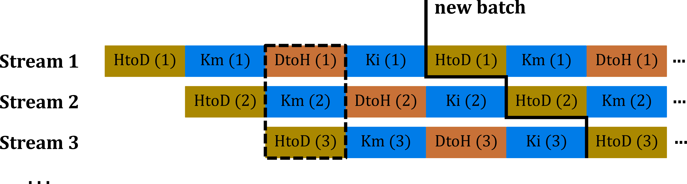

# DD2360 Applied GPU Programming: Final Project

1. [Introduction](#introduction)
2. [Methodology](#methodology)
   1. [Porting the Particle Mover](#porting-the-particle-mover)
   2. [Porting the Grid Interpolation](#porting-the-grid-interpolation)
   3. [Mini-Batches](#mini-batches)
   4. [Pinned Memory, Streams and Asynchronous Copy](#pinned-memory-streams-and-asynchronous-copy)
   5. [Kernel Fusion](#kernel-fusion)
3. [Usage](#usage)

## Introduction

The particle-in-cell method (PIC) is used to solve differential equations numerically that emerge in a certain class of physics simulations. The basic idea is to move individual particles in a continuous space while other quantities, such as densities and fields, are defined and updated on a discretized grid. A typical use case for PIC methods are plasma simulations where electrons and protons are treated as computational particles and electric and magnetic fields are defined on a three-dimensional grid.
This project deals with a simplified version of such a plasma simulation ([original code](https://github.com/iPIC3D/sputniPIC)). The particles’ movement (position and velocity) is described by ordinary differential equations that are solved for each particle using interpolated electric and magnetic fields at the particle’s position. In a second step, charge density, current density and pressure are interpolated to the grid nodes. The third step, a field solver, is omitted in this project for the sake of simplicity. The huge amount of redundant operations involved in this kind of simulation makes it a suitable candidate for parallel processing.
The purpose of this project is to port the serial PIC code to CUDA so that it can be offloaded to the GPU where it is executed in parallel.

## Methodology
### Porting the Particle Mover
In order to bring the particle mover functionality to the GPU it is crucial to take care of the data movement correctly. We opt for an approach that copies entire data structures (*particle*, *EMfield* and *grid*) to the device because it makes the translation of *mover_PC()* a straightforward task. Once the structures are accessible from the GPU a global kernel can be created which closely resembles the *mover_PC()* function. The only differences are that a thread ID is computed at the beginning of each kernel call and the inner for-loop is replaced by a simple if-condition (the ID should be smaller than the total number of particles) to ensure that only valid computations are performed. The inner loop iterator is hence superseded by the thread ID. Furthermore, this kernel works
with the flattened versions of the multidimensional arrays only to facilitate the data movement.
The memory copy is performed by a function called *particle_move2gpu()* for the particle array. At first, memory is allocated for the structure itself and all of the arrays involved. In a second step, array values are moved to the device using *cudaMemcpy()*. We then create temporary copies of the host pointers and let the host pointers point to the device addresses instead. Thereby, a simple
*cudaMemcpy()* suffices to copy the scalar values contained in the host structure and correct array pointers to the device structure. Finally, the host pointer addresses are restored. The function *particle_move2cpu()* is based on the same idea and moves the structure back to the host. Moreover, *particle_deallocate_gpu()* is used to free memory on the device side. Analogous functions are provided for the field and grid structures. The function *mover_PC_gpu_launch()* takes advantage of these helper functions to manage data movement as well as memory allocation and to call the actual kernel. The number of threads per block can be specified in the input file with the *tpb* identifier.

### Porting the Grid Interpolation
Data movement is taken care of in the same manner as before. The only but important difference to the step described in section [Porting the Particle Mover](#porting-the-particle-mover) is that almost all the data can remain on the GPU when the particle mover and the grid interpolation are performed on the device. *part*, *field*, *grd* and *param* are hence just copied once at the beginning of the simulation. The *ids* structure containing interpolated densities on the grid nodes is the only cause of data movement overhead
during the simulation. It has to be copied back to the host before CPU post-processing is applied and it is written to the output file. The post-processed version of *ids* is then copied to the GPU again at the beginning of the next cycle. From this task onward *mover_PC_gpu_launch()* and *interpP2G_gpu_launch()* are only used to launch the kernels and do not manage the data movement anymore to
account for this new policy. The interpolation function is converted into a CUDA kernel in a very similar way to the one explained in section [Porting the Particle Mover](#porting-the-particle-mover) as well. The serial loop over all particles is replaced by a computation of the thread index and a check whether this index corresponds to a valid particle index. An important aspect to ensure correctness of results is to use *atomicAdd()* when modifying the densities at a certain grid node because multiple threads may attempt to access the same memory location at the same time which can lead to race conditions that will ultimately impair the simulation output. It is worth mentioning that atomic operations do not solve the problem of numerical reproducibility (cf. [Reproducible floating-point atomic addition in data-parallel environment](https://ieeexplore.ieee.org/abstract/document/7321514)). The atomic floating-point operation will
not be completely deterministic and small deviations in the output values might be entailed.

### Mini-Batches
If the number of particles in the simulation exceeds the memory capability of the given GPU hardware it is inevitable to employ a mini-batching scheme where subsets of particles (batches) are transferred to the GPU and processed one at a time. To this end, we introduce a new parameter *nob* that defines the number of batches and can be set in the input file. If a desired number of particles does not fit in the GPU memory this parameter can be increased to reduce the required amount of memory. Only *ceil(#particles/nob)* particles will be stored on the device simultaneously. A newly created function *particle_batch_create()* splits the *ns* (number of species) particle structures into *ns\*nob* particle structures. Thus, each batch contains a certain, not necessarily equal number of particles from each species. There will be no batches that contain only a single particle type.
Furthermore, a new inner loop iterating over these batches is added to the main simulation loop. The current particle data on the GPU is overwritten with a new batch, the kernels are executed and the resulting new particle quantities are copied back to the CPU memory for each batch. This happens in every simulation cycle and is only possible because the particle updates can be computed independently.

### Pinned Memory, Streams and Asynchronous Copy
<p align="center">

</p>

As all the particle arrays are moved in and out in every cycle when using mini-batches it is reasonable to believe that some latency is added together with this feature. Therefore, the next step of this project is to optimize the CUDA code and overlap data transfers with computations in order to hide as much of the additional communication cost as possible. For this purpose, the workload is distributed among several streams (cf. [CUDA Streams: Best Practices and Common Pitfalls](http://on-demand.gputechconf.com/gtc/2014/presentations/S4158-cuda-streams-best-practices-common-pitfalls.pdf)) and some of the data is stored in pinned memory on the host side. This applies to *ids* and *part* which are both transferred several times during the simulation. *field*, *grd* and *param* on the other hand are only copied once so that pinned memory, which is a limited resource, is not necessary.
The advantage of using pinned memory is twofold: In spite of being more expensive in terms of allocation and deallocation it allows for higher transfer throughput and thus speeds up large or frequent memory transfers. In addition, pinned memory is a prerequisite for *cudaMemcpyAsync()*, the asynchronous version of *cudaMemcpy()*, which is used to enable simultaneous communication and computation (CUDA kernel calls are asynchronous with respect to the host by default). The dedicated DMA (Direct Memory Access) hardware allows to
run two data transfer operations (HtoD and DtoH) at the same time while CPU and GPU are freed for concurrent computations. The particular strategy employed in this project is visualized in the figure and explained in the following.
Assuming *nob* is chosen so that one batch’s particles just fit on the GPU, we need an additional level of granularity (subsplits) to allow concurrent host-to-device and device-to-host copies without interference. Hence, a number of subsplits per batch (*n_streams* can be set in the input file) is created first. In contrast to the mini-batch implementation, where each batch contains particles from all the species, the subsets are filled with one species at a time until that particle type is used up. Each set is then assigned to its own GPU memory segment (buffer) and is processed by a separate stream, i.e. all the asynchronous operations (HtoD-copy, mover kernel, DtoH-copy and interpolation kernel) are put into their respective queues at the beginning of each cycle. Thus, computation and communication will be overlapped whenever possible. If three or more streams are set up three-way concurrency is possible as indicated by the dashed box in the figure. The unbroken line labelled ”new batch” shows that the computer can start to load a new batch of particles on the GPU even before the last one is completed. However, whether HtoD-copy and DtoH-copy are actually performed at the same time or only one
transfer direction is overlapped with the kernel (i.e. two-way concurrency) depends on varying factors, such as exact timing and the number of splits.
Another important aspect with regard to concurrency is the issue order (cf. [CUDA C/C++ Streams and Concurrency](https://developer.download.nvidia.com/CUDA/training/StreamsAndConcurrencyWebinar.pdf)). We considered two different approaches:
1. Triggering all operations of one stream before processing the next stream, i.e. HtoD(1), Km(1), DtoH(1), Ki(1), HtoD(2), ...
2. Grouping similar operations of all streams before continuing with the next kind of operation, i.e. HtoD(1), HtoD(2), ..., Km(1), Km(2), ...

Both methods can perform very differently depending on the GPU generation and compute capability (see also [How to Overlap Data Transfers in CUDA C/C++](https://devblogs.nvidia.com/how-overlap-data-transfers-cuda-cc/)). In our case, the latter approach proved to be more promising according to some simple tests and is hence used for the rest of this project.

### Kernel Fusion
After completion of all the steps described before the particle mover and the interpolation from particle to grid can be combined in a single kernel. As both operations have already been completely offloaded to the GPU, so that particles can be kept on the device in between, this is a straightforward task. The new kernel simply executes the previous kernels’ functions consecutively.

## Usage
The Git repository contains a separate branch for each grading level so that the experiments can be repeated for each intermediate step. After checking out the correct branch and compiling the code using the *makefile* it can be executed with input arguments specified in the input file. Newly introduced parameters added to control the GPU implementation are described in the [Methodology](#methodology) section. 
The code can be executed in the following way:
```bash
./bin/sputniPIC.out inputfiles/GEM_2D.inp
```
